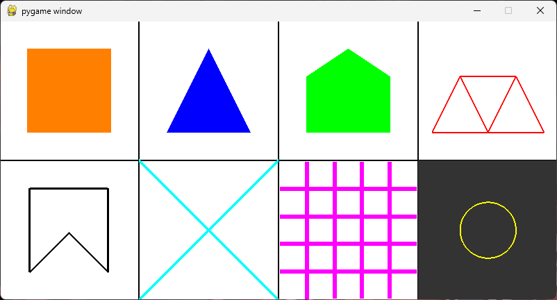

# Projetos de Computação Gráfica

Este repositório reúne pequenos projetos em Python que demonstram gráficos 2D/3D usando bibliotecas como `pygame` e OpenGL. Este README explica como criar um ambiente virtual (`venv`), instalar dependências e executar cada projeto.

**Pré-requisitos**
- **Python**: 3.8+ recomendado. Verifique com `python --version`.
- **Git**: para clonar o repositório (opcional).

**Como criar e ativar um `venv`**

- Criar o ambiente virtual (Bash / WSL / Git Bash):

```bash
python -m venv .venv
source .venv/bin/activate
```

- Windows (PowerShell):

```powershell
python -m venv .venv
.\.venv\Scripts\Activate.ps1
```

- Windows (CMD):

```cmd
python -m venv .venv
.\.venv\Scripts\activate.bat
```

Depois de ativar o `venv`, atualize o `pip`:

```bash
pip install --upgrade pip
```

**Instalar dependências por projeto**

Cada projeto tem um arquivo `requirements.txt` próprio. Navegue até o diretório do projeto desejado e instale as dependências com:

```bash
pip install -r requirements.txt
```

**Como clonar e rodar (exemplo com `labirinto`)**

```bash
# clonar
git clone https://github.com/dbreskovit/computer-graphics-projects.git
cd computer-graphics-projects

# criar e ativar venv
python -m venv .venv
source .venv/bin/activate    # ou o comando equivalente no Windows

# instalar dependências do projeto e executar
pip install --upgrade pip
pip install -r labirinto/requirements.txt
python labirinto/main.py
```

# Projetos Desenvolvidos



**Formas Geométricas**

---


**Labirinto**

---


**Três Cubos**

---


**Sistema Solar**